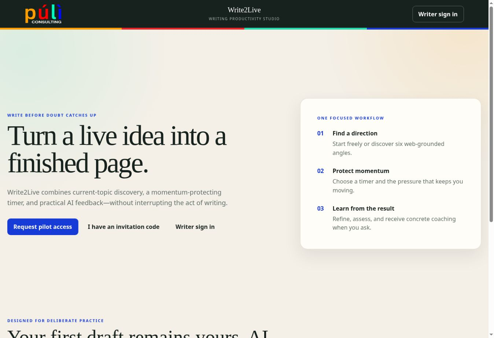

# Write2Live

**Website:** [write2live.puli-consulting.com](https://write2live.puli-consulting.com)

**Turn a live idea into a finished page.**

Write2Live is a focused-writing service from Puli Consulting. It helps writers find a direction, protect momentum with a flexible timer, and request practical AI refinement, assessment, and coaching after writing.

## Choose the right entry point

| You are… | Start here | What happens next |
| --- | --- | --- |
| A new visitor without a code | [Request an invitation](https://write2live.puli-consulting.com/request-access) | Tell us what you hope to write. Puli Consulting reviews the request before issuing access. |
| A first-time writer with an invitation code | [Activate the invitation](https://write2live.puli-consulting.com/register) | Use the code and the same email address that received it. The pilot includes two completed writing sessions. |
| A returning registered writer | [Request an email sign-in link](https://write2live.puli-consulting.com/signin) | No invitation code is needed. The private link works once and expires after 15 minutes. |

Submitting an access request does not immediately create an account and does not guarantee approval.

## What Write2Live supports

- timely, web-grounded topic discovery;
- English and Chinese writing sessions;
- flexible timers and optional momentum guidance;
- protected in-browser drafts during writing;
- comparison of original and AI-refined text;
- writing scores across grammar, clarity, engagement, and structure;
- concrete improvement suggestions and exercises;
- encrypted completed-session history and progress; and
- export of drafts and results.

## See the writing workflow

The interface keeps the current stage, AI readiness, remaining pilot sessions, and the progress route in a persistent header while you work.

### Choose a current direction

### Review a structured assessment

### Turn feedback into practice

## Private-pilot status

Write2Live is currently an invitation-only pilot in the v0.9 release series, targeting v1.0 for formal launch. Each approved invitation currently provides two completed sessions. Features and pilot terms may change before the formal release.

## Repository purpose

This public repository contains user documentation, privacy information, screenshots, release-facing guidance, and support material. Production source code, service credentials, deployment configuration, and internal operating records remain in a separate private repository.

## Documentation

- [Getting started](docs/GETTING_STARTED.md)
- [Pilot administration](docs/PILOT_ADMINISTRATION.md)
- [Privacy](docs/PRIVACY.md)
- [Security reporting](SECURITY.md)

## License

Public documentation in this repository is provided under the [MIT License](LICENSE).
