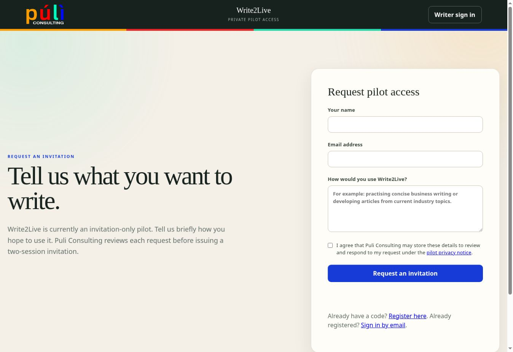
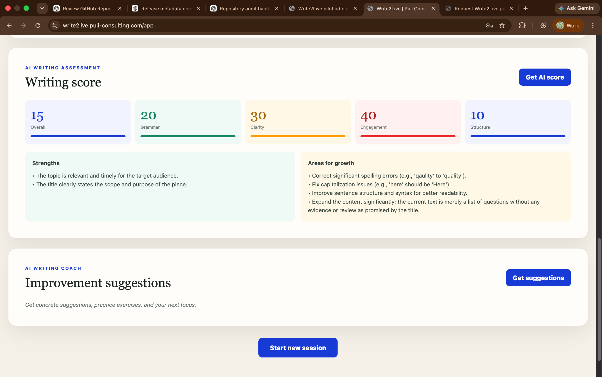
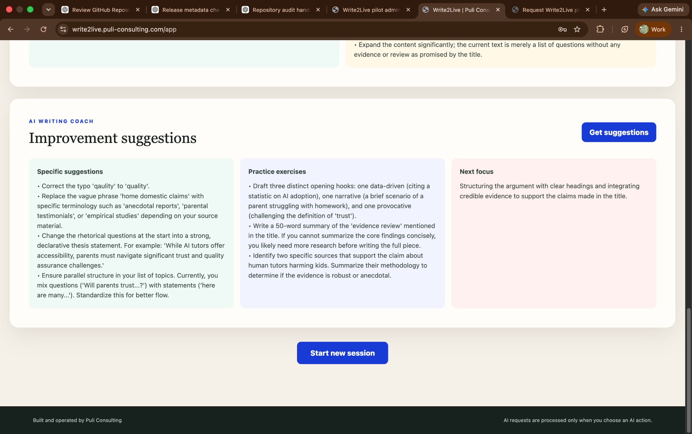

# Getting started

Write2Live is currently available through an invitation-only private pilot.

## 1. Get access

Choose the route that matches your situation:

### I do not have an invitation code

Open [Request pilot access](https://write2live.puli-consulting.com/request-access). Enter your name, email address, and a short explanation of how you would use Write2Live. Accept the pilot privacy notice and send the request for review.

The request does not create an account. If Puli Consulting approves it, an invitation code will be emailed to you. Check the junk or spam folder if the message does not appear in your inbox.

### I received an invitation code

Open [Activate an invitation](https://write2live.puli-consulting.com/register).

1. Enter the same email address that received the invitation.
2. Enter the complete invitation code from the email.
3. Review and accept the pilot privacy notice.
4. Select **Activate invitation and open workspace**.

The invitation is email-bound, works once for registration, and currently provides two completed writing sessions.

### I already registered

Open [Returning writer sign-in](https://write2live.puli-consulting.com/signin). Enter your registered email address and select **Email my private sign-in link**. Open the newest link in the email; it works once and expires after 15 minutes.

You do not need the original invitation code again. Check the junk or spam folder if the sign-in message does not appear in your inbox.

## 2. Complete a writing session

1. Write freely, enter a topic, or discover six current web-grounded angles.
2. Choose a writing direction.
3. Set a duration from 1–60 minutes.
4. Choose Zen, Gentle, Moderate, or Strict momentum guidance.
5. Write until the timer ends, then finish or add a short extension.
6. Request refinement, assessment, or coaching only when you want AI assistance.
7. Copy or export the writing and results you want to keep.

An unfinished draft stays in the current browser so it can be resumed on the same device. A completed session is stored encrypted and appears in your progress history. Only the first completion of a session uses one pilot credit.

## 3. Follow your status

The pinned header keeps these signals available as you move through a long setup or results page:

- the current workflow stage;
- AI search and feedback readiness;
- the number of pilot sessions remaining; and
- **View progress**, which opens your completed-session history.

## 4. Understand the main terms

- **Writing workspace:** the page where you choose a direction, set the timer, and write.
- **Completed session:** a session you finish and save; this uses one of the two pilot credits.
- **AI refinement:** an optional corrected version shown beside the original.
- **Writing assessment:** optional scores and areas for growth.
- **Writing coach:** optional suggestions, exercises, and a recommended next focus.
- **Progress:** a history of completed-session metrics and scores.

The administrator access code is not a writer sign-in method. It is reserved for the pilot administrator and superusers.
